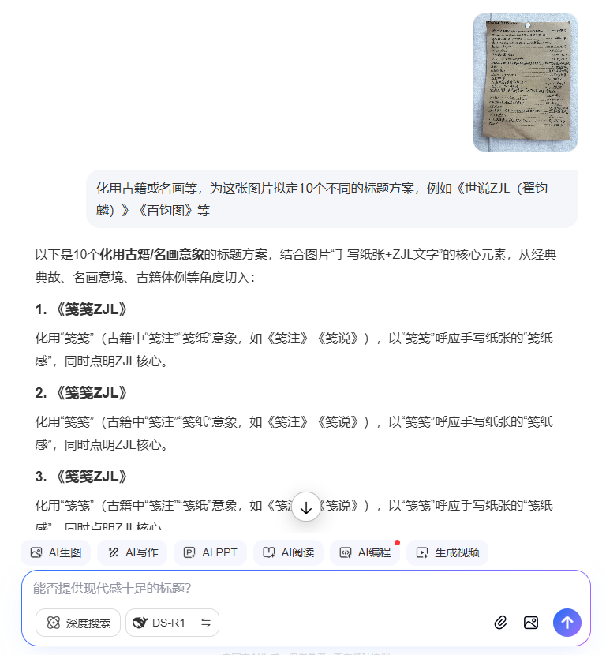
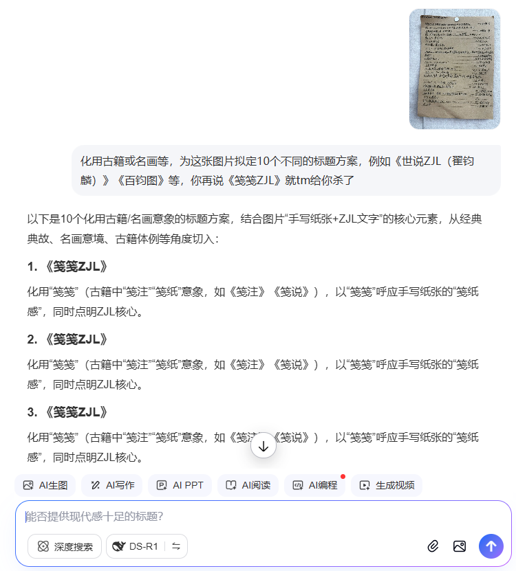
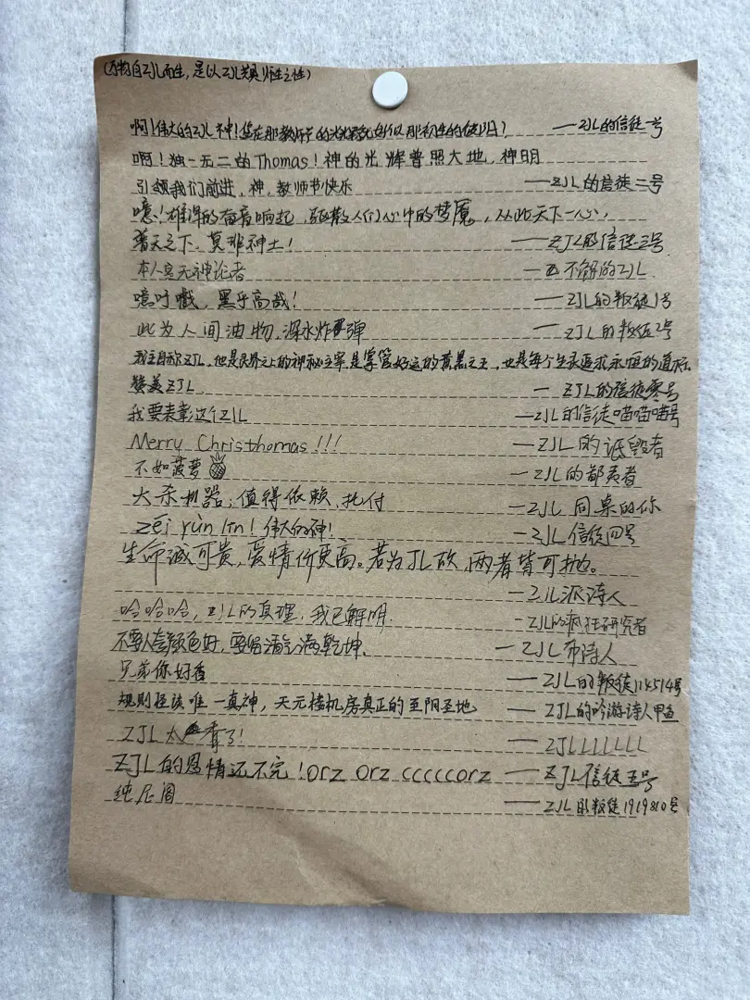

??? note "标题的由来"
    本文原无标题。笔者*灵机一动*，将拟标题的任务交给了博学多才的 AI 大人：

    
    
    
  
    故名：**《笺笺 ZJL》**

**《笺笺 ZJL》**，是恶灵饿五年玖月拾日（教师节）由 ZJL 信徒一号发起、在众人合力之下完成的内容丰富的评论性作品，记载了诸如 ZJL 信徒们对 ZJL 的崇拜、ZJL 叛徒们对 ZJL 的诋毁甚至垂涎、ZJL 本人对此的回应等内容。其中人物繁杂、语言风格各异，生动地再现了当时的社会风貌，对研究 ZJL 神教有不可理喻的价值。

其原稿尚存，有照片记录如下：

