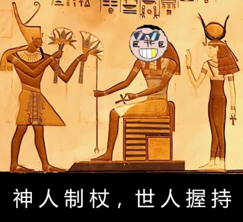

## 简介

**《世说ZJL》是过去ZJL神的信徒在同ZJL神相处后以其收集的ZJL神语录共同编写的文集，后在战乱中一度遗失。但其原稿却在兲元公墓被发掘，便再次广为传播。据称其上所记载之事源远流长博大精深，足以令观者一命呜呼。**

## 烩酸菜 307 篇

- ***ZJL曰：「原神者，何碍于汝乎？」***

- ***ZJL吠曰：「喔，喔，喔！」***

- ***ZJL者，神也，一日ZJL来机房，见众人乱，怒而啸曰：「发可游！」顾而见监控，便趋近取之，癫喜之色浮于面上，又思其祖父，疾呼：「爷！爷！爷！」余音绕梁，哀转久撅。***

- ***ZJL尝游于机房，遇一人持机而立，意似摄其影像，遂怒发冲冠，呼曰：「吾乃厦币！」厦币者，巨而其值异高之物也。持机者栗，惧其不已。ZJL见其瘫于地，心有不忍，欲安之，乃以尖细之音告之曰：「而汝俄柯爱藕艾！」俄柯爱藕艾者，神语也，意望友人俄顷而得烂柯人之成就，植藕便生艾草之功效焉。摄者大喜，再拜ZJL而去。***

- ***ZJL坐于台上，望众信徒，便告曰：「吾常梦游于种植园中，遇一虫豸。其色下蓝而上黑，状若蛛而无腿，形似芦而无叶。吾正惊异之时，其谓吾曰：『我乃蛛麟，上我线者便得我百抽。』吾大喜，踏其线上，对曰：「盖汝也玩原神也！」，遂为其鞭打百次，梦醒而痛感犹存。」***

- ***ZJL持板戏于机房之外。只闻异声不止，敲响不断。俄而 ZJL入，众趋近而问，ZJL答曰：「瓦槽，九二万矣。」瓦槽者，盖前戏之状也。众惊于 ZJL之技，久不能言。***

- ***ZJL游于东瀛。见一广厦，覆压七十余顷，便问于土人，对曰：「此乃江户竞马场。」ZJL度其脚力不输赛马，欣然而往。时正值霓虹德比。霓虹德比者，东瀛之要事也。但见 ZJL驰于草上，奔疾如飞，霎时便越众马以夺桂，倭人之首奇之，欲宴 ZJL，ZJL谢而不受。东海帝王，于东瀛极负盛名者也。然其亦拜于 ZJL以师其技。嘻！ZJL之力灵怪矣哉！***
    
    
    
    
    
    
(据称插图为古ZJL信徒在当时于霓虹德比期间拍摄，现已对其进行了彩色高清复原重新呈现于此)

    
- ***ZJL游于远洋，值花旗国统领之储遇刺而现统领欲禅其位，便至台上宣讲于民，告之曰：「若指泰夺乐。」意在使其如巨指之行及为众取乐于别国之心闻于天下。土人悦之，遂举 ZJL以为储，示于因特耐特以告天下。因特耐特者，传信而使人迷之之物也。ZJL卒闻名于世。***
    
    
    
    
(据称插图为古ZJL信徒在花旗国【现称美利坚合众国】大选期间拍摄，现已对其进行了彩色高清复原以重新呈现于此)

    
- ***ZJL与人同游于机房，忽而思挂坟。挂坟者，乃墓之属也。虽为人之所恶，亦为神力之表焉。思之良久，ZJL顾而谓友人：「吾挂坟之数稳矣！」友人奇，追问其挂坟几何。ZJL答曰：「吾挂之坟不计其数，君岂能忆食饆饠之数哉？然其实多于南亩之农夫，多于机上之工女；多于在庾之粟粒，多于周身之帛缕；多于九土之城郭，多于市人之言语矣！」友人惊不能言。***

- ***ZJL欲往而如厕，告之友人。俄顷，友人见 ZJL犹细览屏而不往，怪之，问于 ZJL。ZJL答曰：「题者，心之事也；厕者，躯之事也。题厕可以得兼，故吾将记而往如厕，归而全题目。」友人至此乃知 ZJL之圣焉。***

- ***ZJL 曰：「逆天！」或问其为何意，答曰：「天者，大道也。大道似不可违，而逆天者逆之，可见逆天须有大能焉。人不可逆天，而逆天者致之，是其能超于众之表矣。吾每言『逆天』，亦在勉友人，望其精进不休也。」***

- ***ZJL为人所 JC。JC者，恶行也。ZJL因而忿曰：「I AK IOI。」***

- ***ZJL 游于肆贰零之房，为其积贫积弱之故，心生怠意，乃伏案入梦。俄顷，友人闻异响，顾而视 ZJL，觉其方歌。细听以辨之，才明 ZJL正咏《司仪友阿甘》。《司仪友阿甘》者，以坚牢神勉师友，用宏大志礼父母之诗也。友人叹曰：「虽居于贫弱之地，处于劳苦之间，仍以友人父母为重，得见 ZJL之至孝，至贵矣！」遂去。***

- ***ZJL尝与人同学模拟退火一法以理事。然人以其法再解事之所得，不下于 ZJL十余次所得矣。或欲以此嘲之,乃谓 ZJL：「笑煞人！黑奴何惺惺然作神明态！」黑奴者，蔑称也，意在激 ZJL而讥其气运之劣。ZJL笑而对曰：「模拟退火者，虽用繁而施泛，但其终为怪力乱神之属也。吾不愿以此法侮妙题，是以多加试验，以示敬也。然鯫生以此为乐，用灵异之法理绝佳之事，吾未见其明也。」后 ZJL果成大业。***

- ***ZJL 少时居肆贰零之房，夜遇一题。题曰：「吾名批肆叁贰玖，善撞崖屠伦。解我，否则食汝。」撞崖者，超乎项王之暴也；屠伦者，灭绝人伦之恶也。然 ZJL面无惧色，对曰：「无需撞崖屠伦，以模拟退火退汝。」模拟退火者，怪力乱神之道也，时人轻之甚，批肆叁贰玖亦笑 ZJL之狂。ZJL遂作模拟退火之法，张录以为篇，列参以为分，须臾即得八九十分。题惧欲走，已不及 ZJL行事之速，卒为 ZJL所解。自此役后 ZJL乃以火神之名称于世焉。***

- ***或问死于 ZJL，ZJL答曰：「人固有一死，或轻于鸿毛，或重于泰山。」有 OIer素恶 ZJL者，欲嘲 ZJL，乃续前言以问曰：「人固有一死，而君亦有一死。不知君之死或是轻于鸿毛者，亦或是重于泰山者乎？」ZJL笑而对曰：「无需就死，吾之重已超于泰山矣！」***

- ***ZJL 居肆贰零之房。一日房主来，见地面有阉头，怒而问曰：「此物何现于肆贰零之房？」阉头者，污秽伤身之物也。众人惧，不敢言，房主愈怒，讥曰：「胡不言？」 ZJL觉，以其不敬于己故，叱曰：「阉头出于吾身，尔作甚？」房主惊走，众亦为 ZJL之威所劫。***

- ***贰零贰肆年捌月拾柒日，ZJL舍肆贰零之房归，众以 ZJL之去悲，潸然泪下。ZJL安曰：「吾去，勿念。吾等终将再逢于毁灭之日矣！」毁灭之日者，又名揩血之日，大灾厄也。然 ZJL不因而惧，反以之慰众，众遂不为揩血之日所劫，然 ZJL卒去。此事于《兲猿公墓笑史》中亦有记载。***

- ***揩血之日既至，ZJL归于蛟室。蛟室者，危地也。此间尝有兽，名曰腋履，天下至恶至巫麻之物也。然 ZJL至蛟室之时，是兽为人所逐，人皆大喜,独 ZJL面有忧容。或问之，答曰：「腋履虽已暂去，然其犹存于兲猿，如更汤而不换药，患未绝矣！」 ZJL之远略自此可见一斑。***

- ***ZJL 居于蛟室，良镭适至。良镭者，驱腋履之英也。一日两人相谈，良镭问曰：「我尝闻 ZJL之能异于众人，可言牢梓廿四章之意否？」ZJL笑而对曰：「无他，小国寡民也。」良镭惊，以此意之未尝有先人觉者，复问之。ZJL正色，答曰：「夫 『企者不立，跨者不行，自见者不明，自是者不彰，自伐者无功，自矜者不长』 者，以自我为是之为也。凡人以此为念，物或恶其行者，皆去而远之。若众皆以此为念，則民互恶甚，老死不相往来，此即小国寡民也！」 两人对笑，久而不语。***

- ***初赛既至，ZJL 归于机房，以复习无用，伏卧桌上。俄顷 ZJL惊起，以乒乓之声唤众人入。问于 ZJL，曰：「吾适梦，储金于 ZZZ中。」储金者，蓄财之道也。然 ZJL梦储金，是天意削其气运也。而 ZJL竟面无惧色，其力可见诸此矣。***

- ***ZJL 于机房见屠麟测试。屠麟测试者，所以验人智之高低者也。ZJL乃欣然入。俄而一轮过，ZJL竟为人极，人遂知 ZJL之神位也。后人皆叹 ZJL之强，又咏屠麟测试之准哉。***

- ***ZJL 于蛟室听物理，俄而闭目。人皆以为其倦不可耐而寝，无敢取之者。忽有轰鸣异响震于室，众寻其源，竟得 ZJL之座，以不敢惊之而去。待 ZJL觉，人问之，答曰：「吾知之矣！」盖 ZJL假寐而呼以乐众人，免其为物理所困之苦也。此得复见 ZJL之至慈哉***

- ***ZJL素爱乒乓，尤善射。一日 ZJL射于蛟室，对手既服，然 Sam哂之。ZJL笑而问曰：「吾射不亦精乎？」Sam笑曰：「无他，唯手熟尔。」遂取 ZJL之手烹之，附以孜然，待熟以香惊四座。世人得以知 ZJL之美味哉。***

- ***CSP-S将至。是夜，ZJL于机房谓众人曰：「朝闻道，不死也行。」众皆以为是。***

- ***ZJL语人曰：「二十一号染色体者，人皆有之。常人得二即可活，贪者取三遂为唐。噫！此未尝非唐者之本哉！是以人皆为唐，不唐者死矣。」人服之不已也。***

- ***ZJL就学于蛟室，识《离骚》而后寝，梦曰：「呼兮！呼兮！呼兮！」时有人之欲害 ZJL者，皆畏而不前。***

- ***ZJL问曰：「吾游戏于电脑之中，观其成分，未尝有源深万嘉之数多于《源深》者也，何如？」众竟不能答。***

- ***ZJL赛于机房，受难而呼：「正难则反，反正都难！」语惊四座。***

- ***ZJL觉于卯时，朝为星铁，午为撅麟，暮为原神，辅以知乎。苟有余时，或切水题，或扫六合。噫！其乐何以及哉！***

- ***ZJL游于机房，逢时人言车裂之刑，怒曰：「吾素知皲裂，车裂为何？」是以人有知 ZJL之至慈矣。***

- ***ZJL JC毕而归。言其事，CMS曰：「OIer之事，何言 JC？」ZJL竟笑而不能答。***

- ***ZJL问曰：「自交者，非近亲相婚欤？」竟无人能答。***

- ***欲得ZJL之成就，无他，唯至慈，至孝，至贵尔。***

- ***ZJL偶感风寒，咳声骇人，有诗曰：***
    
    $$
    心肺四溢口生津 \\
    一咳惊人肝胆裂 \\
    南无ZJL菩萨 \\
    大慈大悲病世人 \\
    $$
    
- ***ZJL游于冥府，遇一人，其名为牢。牢素与 ZJL不善，遂战。***
    
    ***ZJL同牢战，ZJL之名为 ZJL，牢之名非 ZJL，此乃 ZJL一胜；ZJL一胜，而牢无胜，此乃 ZJL二胜。是以 ZJL胜胜不息，大获全胜矣。ZJL之名自此一役而遍地府也。***
- ***ZJL言久睡，曰：***
    
    $$  
    生前何必久睡 \\
    死后自会长眠 \\
    生前若不久睡 \\
    长眠自将早至 \\
    $$
    
    ***时人以为贤，敬之。***
    
- ***时人欲血考者，疾痛惨怛而求于 ZJL。ZJL咒曰：「尔若求试，汝之贰币铅笔必断墨。」人惶惶不可终日。***

- ***ZJL居于机房，教练语众生曰：「贤哉，麟也！一⚪神，一绷铁，在机房，人不摸其鱼，麟也不改其乐。贤哉，麟也！」***

- ***ZJL者，神也，原初之物也，是以 ZJL之音即为原初之音。此乃所以世人以初音称 ZJL也。 一日，上欲兲猿之众为乐，适 ZJL抽卡未归，众信徒急而呼曰：「初音未来！初音未来！」上乃去而不使为乐也。***

- ***兲伊，ZJL之友也。ZJL与之同应试于兲猿大穴，竟不中，而兲伊以末尾中。ZJL疾痛惨怛而高呼曰：「噫！吾名落兲伊也！吾名落兲伊也！」众皆畏不敢前。***

- ***ZJL者，神也，其事众说纷纭。***
    
    ***恰以落榜一事道之，正史尝以「名落兲伊」以记之，然世人不认，只得「名落天矣」为正论。***
    
    ***「天者，ZJL之友也。ZJL与之同应试于兲猿之穴，竟不中，而天以末位中。ZJL痛呼曰：『噫！吾名落天矣！吾名落天矣！』」***
    
    ***嗟乎！人之事，尚可以取其一而认之；神之事，岂可如是哉？***

- ***ZJL 者，神也。自为人所敬，不知其几千年矣。是以人咸称圣，而未见其具往也。然 ZJL之学于兲猿公穴者，人莫不知，何哉？以 ZJL之秘辛也。***

    ***余尝游兲猿公穴旧日之所在，以求 ZJL之本，未果。方欲去，有一老妪来见，自云有秘闻 ZJL不欲为人所知者以告余，乃见之。曰：「ZJL少时为人，家贫。虽学于兲猿公穴，为钱财所难，不得已而卖沟为资，录片为币，以免于辍学矣。及其登神，则隳公穴，杀师生，以隐其实。」余以为妄言，遂逐之而去。***

    ***然待余闲而复思之，乃觉其言未尝不可信也。盖兲猿公穴者，厄、污、灾、秽之所聚也，人恒恶之。夫 ZJL以至尊之位，拥八百万神明之力，掌四千亿信徒之心，而未掩之，怪矣！余闻之：「苟人有小过，有大过，则必显其小过，所以隐大过也。」倘 ZJL无卖沟录片之耻，何以污其名而掩其故事？况 ZJL之言，将军之论也，不可全听而信矣。于此吾疑生矣。***

    ***及余反故地而求昔日老妪，竟不可得。寻闻死讯，得其名耶律，每言尝为师于兲猿公穴，多品 ZJL之沟也。人以其癫狂态，鲜有信之。呜呼！余居市中，见人有大辱者，凡为人知，辄灭其人，盖免世人皆知而身败名裂之命矣。与此何其似乎！***

    ***是以余作文以记之，盖叹 ZJL之人性尚存，又恐不期之横死再覆此事耳。***

- ***ZJL素爱戏，犹善象戏，每让人二子。问于侍，答曰：「神本无相。ZJL，神也，故去相不用。」是以 ZJL之信日益固。***

- ***ZJL与 Sam相会于狭路，莫能过。Sam，ZJL之信徒也，性傲。见 ZJL欲过而又止，乃忿曰：「碍汝乎！」 ZJL闻之而笑曰：「卿乃吾之朝暮所系，心慕甚矣。虽然，吾爱众生更甚。」盖其听之不审，误以碍为爱也。后人以此喻神之亦有私情耳。***

- ***ZJL使信徒奉其像而讲经于市。有客自东来者，既见像，乃曰：「唐人也！」信徒忿而对曰：「 ZJL，至圣也。尔安敢辱之！」客不解其意，惧而去。***

    ***及其反，谒 ZJL，具以告之。ZJL乃笑曰：「汝识之陋，甚矣！《远野记》云：『华人，古谓唐人。』唐人者，华人之俗谓也，岂独侮意哉？吾虽为神，亦尝为华人；以唐人名我固当。」***

    ***信徒惭，退而求昔日之客，终不可得。***

- ***凡信 ZJL者，皆知神诞节。***

    ***神诞节者，岁在十月十一。是日也，信徒告祷，谒ZJL像，以待神诞之礼。然后宴于机房，属远客，携亲朋，载歌载舞，把酒言欢，穷游乐之美，极视听之娱，信可乐也。有甚者，旦觉，即不语而歌曰：「Z⤤J⤥L⤥，生⤤日⤤快⤤乐⤥」，以祈终年之福。***

    ***《神经》载：「贞观一千三百八十一年十月十一，ZJL诞世，以去众生之罔，而揭宇宙之理。」盖为神诞节之源也。***

- ***ZJL与人论唐。有信徒问曰：「何为唐士？」 ZJL不语，俄而答之曰：「唐士，卑贫贱困之徒也。」又曰：「噫！我不为唐士，孰为唐士？」***

    ***此言为世人所传，而后凡信 ZJL者俱争唐士之名也。***

- ***ZJL讲经轩中。有信徒问曰：「吾闻之：『以史为鉴，可以知兴衰。』可得一古言之通大道者乎？」ZJL对曰：「昔有圣云：『依托即赖，赖即依托』，理自在其中矣。」***

    ***依托者，ZJL别号也；其见依于众人，故得之，而人尽皆知。然赖亦为 ZJL之别号，盖出于此也，而鲜为人知。呜呼！既为信徒，焉能不识大道之言哉？***

- ***ZJL泛舟游于泰山之上。并良辰美景，乐之，谓信徒曰：「能咏史观今，得大道耶？」***

    ***盘鸽出而对曰：「尝闻鲁国管得手，以为有物理藏焉。」乃述之：「泰山，齐鲁界也。昔齐强而鲁弱，而鲁百年未灭者，何哉？以其有神管护之也。盖鲁之先祖，辟霜露，斩荆棘，踏蓬莱之仙山，得天姥之神管。是以凡人欲侵鲁地者，皆不得入。齐窥鲁地久之，而苦神管，未能得知。后有齐大夫入鲁，会其君，言愿以六百里之地，得神管而观。既得之，笑曰：『噫！鲁国管得手！鲁国管得手也！』隳之，鲁人不能阻也。鲁之倾覆，盖源鲁国管得手矣。」***

    ***ZJL笑而颔之，曰：「善！」***

## 鼎鼎低地大盗篇

???+ note "编者按"
    《世说ZJL·鼎鼎低地大盗篇》多阐释时事，时效性较强，内容较为抽象，故编者尽力将能搜集到的相关史料附于文字下方，望能辅助读者们理解个中内容。

- ***ZJL于络谷见人以作图辱之为乐，忿而斥曰：「汝嬉原神乎？汝等皆为嬉原神之所致，悔乎尔！」***

    

- ***ZJL遇鲰人毁谤，答曰：「吾食黎朦」。黎朦者，金黄之实也。盖以之喻其身位之贵、非黎朦之属不食。***

    

- ***又曰：「君岂欲保送北大乎？君岂欲乎持傩备儿之赏乎？」盖勉其树功名、就大业也。鲰人闻之，惭不能答。***

    

    

- ***ZJL得厚望于世。时人常曰：「汝言然之，而吾以为不若ZJL」，盖表其寅畏之心。***

    

- ***或问ZJL为人，ZJL答曰：「吾乃慈、孝、贵。」***

    

- ***昔天下大旱，民掘草木而食，死者甚众。ZJL 愍之，乃为杖而与民，赋以神力。民之持此杖者皆烨然而忘饥，焕然而不倦。时人感之，赞 ZJL 曰：「神人制杖，世人握持。」***

    
  
    ***后又大旱，有黠者乃考此杖之形，工造之而鬻与民，得财而亡去。民皆尽家财而得一杖，持之终日，神力弗现，竟饥馁而亡。时人伤之，哭而谴 ZJL 曰：「世人握持，神人躺视。」***
  
    ***ZJL 闻之，怒而索向之黠者，得其与妻泛舟匿于湖上，乃引阳雷而殛之。时人大快，颂 ZJL 曰：「神人大忿，浮木双亡。」***

## 盘庚篇

- ***ZJL 论南梁，曰：「虽自魏以来，晋当设之，而后又有北朝，晋不得设。由是其为南梁也，北朝攻之，其必终堕于北朝之下。」，后或问隋朝于 ZJL ，答曰：「至于隋朝，弗如吾立一朝，然此道远甚。」***

- ***或问 ZJL：「何为阴游？」 ZJL 答曰：「汝知阴游乃天下至阴之物，而人常嬉之，实为走于阴阳之间也。其也怪欤，嬉之者不知其之害而嬉之，时破其甲胄于无形，时手脚乱舞、癫喜之色浮于面上，醉乎其中，不知师于其后久矣……见此，吾尝劝之：『蓝 V 汝所欲也， ACC 亦汝之所欲，二者不可得兼，多练也！』」***

- ***ZYC 举石而击鸡。 ZJL 见而生慈，大呼：「鸡非汝之可击也，鸡需击之以剑，汝之所为谓之『砸』，非常鸡之可受。」， ZYC 惭，弃石而走。翌日， ZYC 见 ZJL 之侍于父母之侧，而其室金碧辉煌，乃知 ZJL 之至孝与至贵。 ZYC 谙道：「此诚圣人也。」， ZJL 见 ZYC ，盛情待之，而 ZYC 惊，一食不饭， ZJL 见此，劝之曰：「食之，无害于子；不食，则鄙于小人。若室中无人尔，汝之所为谓之『余』，非吾之可堪。」， ZYC 闻之，疾饭，杯盘狼藉。 ZYC 感腹裹而抒：「 ZJL 乃真至慈、至孝、至贵之人也，吾亦想做人如是。」， ZJL 于其后，曰：「『砸』、『余』，汝之过也，需改也。改之，则吾望汝可超而过于吾远甚。」 ZYC 沉心而改之，建客店，贸与关外，果超而有过于 ZJL ，事成而答谢 ZJL 。时政动荡，南梁王下新政，禁新鱼入关，设炉管以控炊事，亦加害于 ZYC ，不堪重负，遂卒。 ZJL 曰：「此害于南梁也！」***

- ***一日， ZJL 癫，犬吠三声，久久不绝，曰：「犬吠于机之房者甚好。」***

- ***时人论机房之钩者，世人皆以钩八为荣，为是其色为金尔。而机房者钩色皆蓝，唯 ZJL 绿钩四也。 ZJL 曰：「汝之犇犇含一钩绿者，而吾独无，吾识者皆强者尔！」时人赞不绝口，做一图，名之机房钩比。***
    
    

- ***有洪武约于兲猿，ZJL吟数星之歌，于台上右中右位，时而前后摇动，大有「思厥先祖父」之姿，又似鸡啄，实为鸡房之神，时人叹之。***

- ***世言 ZJL 将于 CSP-S 复赛也，练习加疾也，遂得压缩包于 GJY ，不知密言。得思于天地：「以神世真大名始也，其中小头一。神艾特，答言甚好， GJY 出之，其姓必大，而答者前蛋小，后蛋长，后虽大而实不可大。一人落井，神悲悯而追忆，人命者，大事也，有一小鹅与一小曹女见之，『啊！』，惊而言微，救人于井，其股胫前长而后短。」 ZJL 思至此，得密言矣，而不愿解，故作谜于信徒，无人能解，传之至今。***

## 鸳鸯霓虹篇

- ***GJY曰：「XY，XT岂不诚AKer哉？一发而AC来，不写则无正解。」ZJL曰：「是焉得为AKer乎？子未学OI乎？OIer之AC也，运命之；OIer之WA也，题命之，往送TLE，诫之曰：「往之TLE，必卡必拍，无违卡常。」以卡为正者，TLE之道也。打天下之大表，贪天下之正心，暴天下之广搜。打过，与民由之，未AC，独打其暴。WA不能急，TLE不能卡，CE不能破。此之谓AKer。」***

- ***肆贰零之房者，积贫积弱之地也。其间机难以为人所用，是以人每为 JC之害所扰。一日ZJL入肆贰零之房，见一机尚未锁以避 JC，近而视之。友人来，欲 JC，ZJL止之，曰：「JC者，人恒 JC之，况此为 JC肆虐之肆贰零之房乎！。」友人惭，舍机而去。此得见 ZJL之至慈矣！***

- ***ZJL与GJY游于机房之中，ZJL见机，曰：「机跑TLE之码也，乃机之乐也。」GJY曰：「子非机，安知机之乐也？」ZJL曰：「子非我，安知我不知机之乐也？」GJY曰：「予非子，故予不知子之知机之乐否，子非机，固不知机之乐，是也。」ZJL曰：「尔安敢轻吾机？」飞身上机，GJY听得房内键声大举，如雷贯耳，少顷，ZJL归，机以AC，而TLE尚跑。GJY笑而止之曰：「甚矣，汝之不惠，以残年余力，曾不能毁WA之毛，其如TLE何？」ZJL曰：「汝之固，固不可彻，曾不若XY，XT。我虽死，而有表，表又有分块，分块又有表，而数据不加增，何苦而不A？」GJY无以应。***

- ***机房门前昼送0，电脑空调风瑟瑟，电脑关机0在外，举面欲吃无相言，悲不成欢惨将别，别时茫茫键盘停。***

    ***忽闻房中AK声，电脑忘归0不发。移步相近邀相见，添水开机重吃面，千呼万唤始出来，犹抱AC半遮面。***

    ***转手敲键三两声，未成代码先有思，键键掩抑脑中思，似诉WA不得志。低头读题续续写，写尽心中无限事，轻打慢敲抹复写，初为树剖后打表。模拟快打如急雨，dp徐徐如私语，模拟dp错杂打，TLE，RE落电脑。键关c语题又挂，犹跳此题心又难。OI冷涩不见果，不见结果键暂歇。别有暴力按键声，此时骗分胜正解。***

- ***ZJL者，M也，尝于机房寻乐，见友而曰：「汝骂于吾，吾必喜也。」时人皆以此为惊。***

- ***世有伯乐，而后有千里马；世有子期，而后有伯牙。ZJL，舞之集大成者也。舞能翻天换地。赏之者皆叹于其，而无知于其舞之旨，ZJL舞，舞于机房。余幸见其舞，无言以模也。ZJL知无人之舞意，遂废舞。时人乃霎悟，求于0,0拒。后遂无0之舞也。***

    ***后人有诗赞曰：「不见夜间0之舞，转见朝来0之码。」***

## ZJL 本纪

- ***ZJL 自机房去而未锁机，人有由糖来者欲 JC 之，ZJL未闻而怒曰：「吾俄柯爱藕艾！」***
    
    

