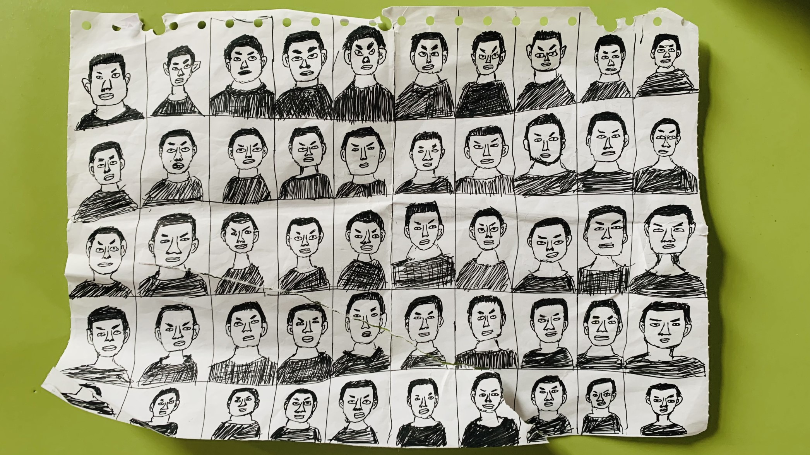

## 简介

> *唐人之精华*
>
> *一百个读者眼中有一百个哈姆雷特*
>
> *一个 ZJL 的笔下有五十个 ZJL*
>
> *唐人艺术的巅峰《 ZJL 证件照手绘 》*
> 
<i>———《百钧图》背面题词</i>

**《百钧图》**（原名 **《ZJL 证件照手绘》**）据传为神 ZJL 于穴拷期间手绘之图样，后在兲元被信徒发掘出来，是极其珍贵的圣遗物。此图或融合了杂交分析法、形态分析法等多学科知识，蕴义丰富。有学者认为其可能暗示了神 ZJL 的相貌变化无穷，不可简单臆断，表达了神对自己容貌的自信、对自己千手百眼能力通天的自许。

现下落不明，仅有史料图存世。

## 实物照

[-compressed.webp)](./images/百钧图(back).JPG)

